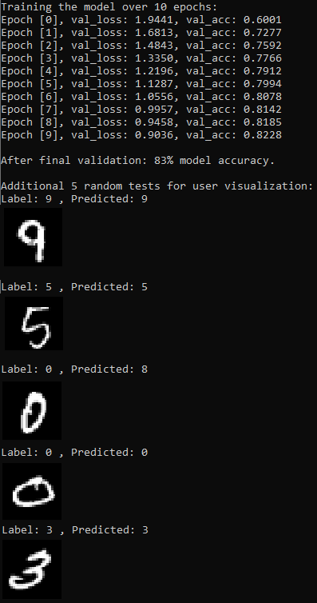
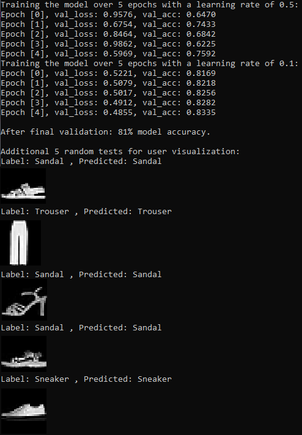
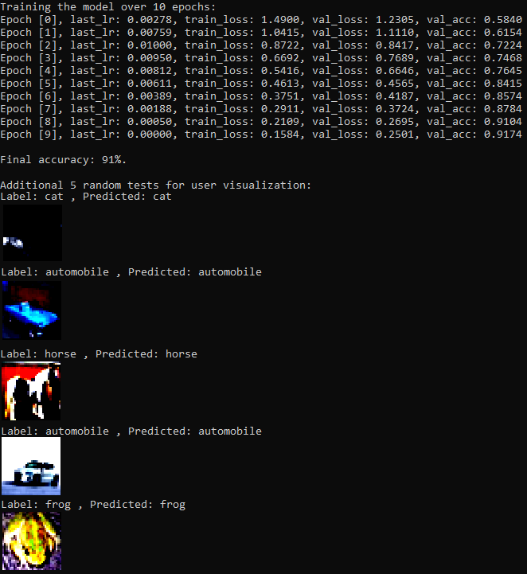
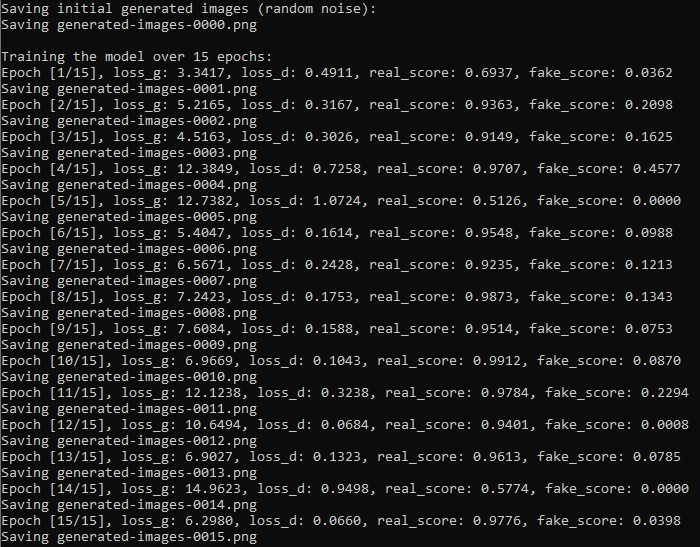
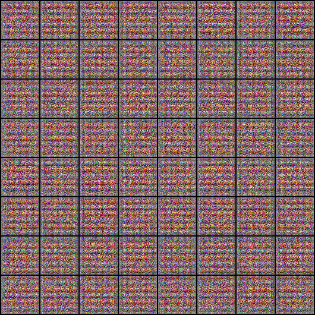

# Pytorch-Projects

Learning Machine Learning with Pytorch.

Tensors, gradients, Numpy, linear regression, logistic regression, gradient descent, working with MNIST datasets, model training and evaluation
, softmax, image classification, GPU training, deep neural networks, feedforward neural networks, convolutional neural networks, underfitting, overfitting
, data normalization, data augmentation, residual connections, batch normalization, learning rate scheduling, weight decay, gradient clipping
, adam optimizer, generative adversarial networks.

Kudos to Aakash N S and Jovian, as well as @bchao1 for the anime face dataset.

# Some results:

Logistic Regression over 10 epochs on the MNIST dataset:

Feedforward Neural Network over 5 epochs with a 0.5 learning rate and another 5 epochs with a 0.1 learning rate on the Fashion MNIST dataset:

Residual Network over 10 epochs on the CIFAR-10 dataset:

Generative Adversial Network over 10 epochs on an anime face dataset:

